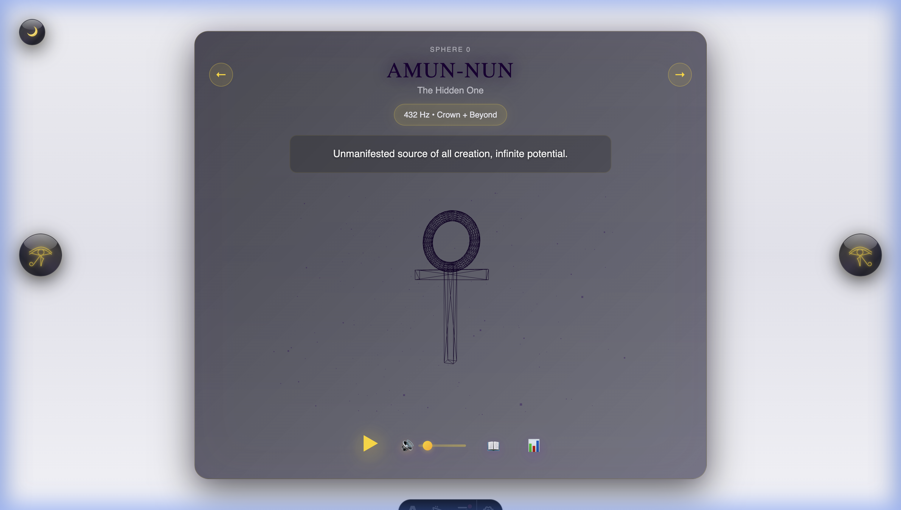
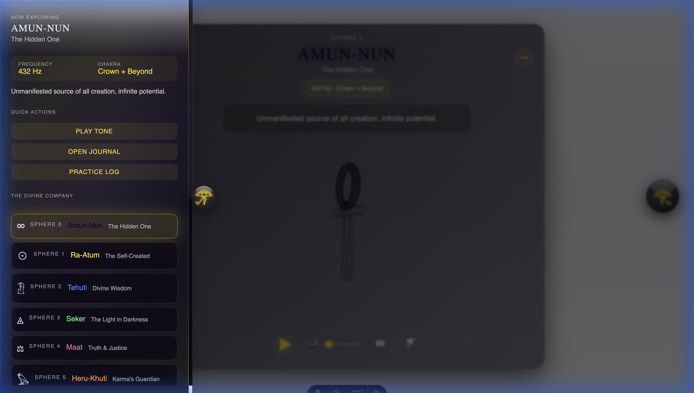
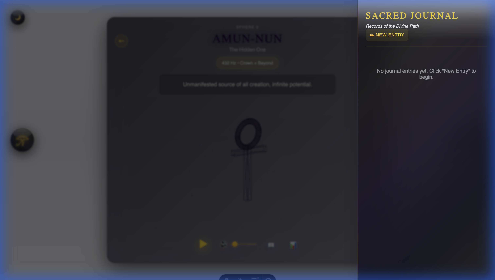
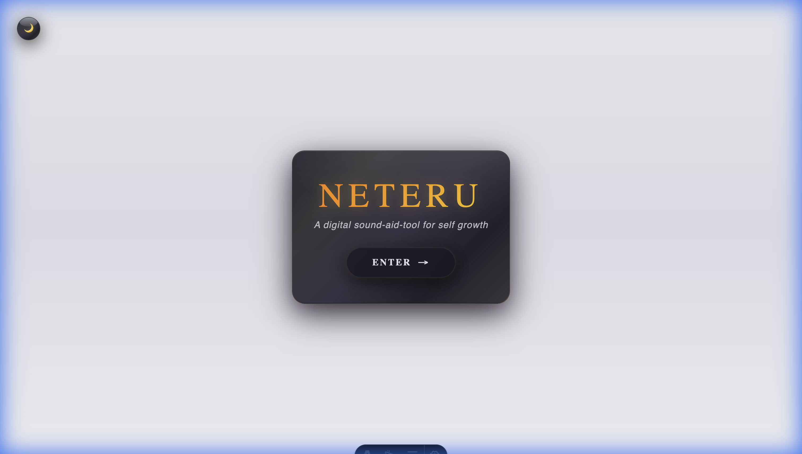
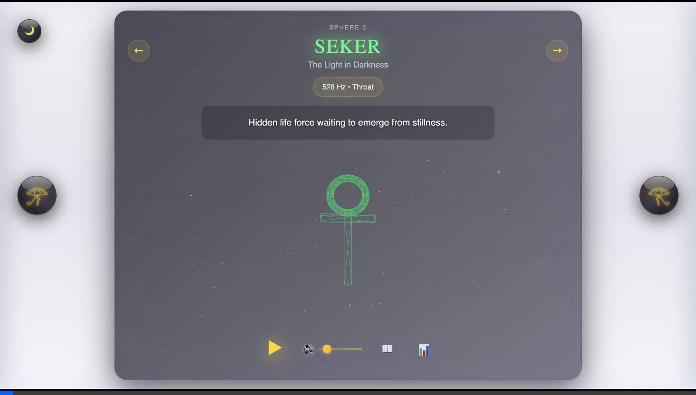

# 🌳 Neteru: Tree of Life

> *A sacred journey through sound, frequency, and ancient wisdom*

**Pautti Neteru** is a spiritual wellness platform rooted in the ancient Kemetic (Egyptian) Tree of Life system. Through sacred geometry visualization, frequency-based meditation tones, and reflective journaling, we offer a digital sanctuary for self-discovery, healing, and spiritual growth.

**Mission**: To bridge timeless wisdom with modern technology, creating accessible tools that empower individuals on their path to inner peace and self-understanding.

---

## 📸 Media Gallery

<div align="center">
  <h3>The Hub</h3>
  
  
  <br/><br/>
  
  <h3>Neter Info & Journaling</h3>
  
  
  
  <br/><br/>
  
  <h3>Welcome Screen</h3>
  

  <br/><br/>
  <h3>Theme Toggle</h3>
  
</div>

---

## ✨ Core Features

- **🎵 Sacred Frequency Tones**: 10 healing frequencies aligned with the Kemetic Tree of Life spheres (174-963 Hz)
- **🌌 3D Sacred Geometry**: Interactive Ankh visualization with audio-reactive particle effects (THREE.js)
- **📖 Voice-to-Text Journaling**: Record reflections via browser speech recognition, edit, and save
- **📊 Practice Tracking**: Session logs with duration and frequency history
- **🌙 Light/Dark Mode**: Adaptive theme for meditation at any time
- **📱 Responsive Design**: Seamless experience on desktop and mobile
- **🎨 Kemetic Aesthetics**: Authentic ancient Egyptian visual language with modern UI/UX

---

## 🏗️ Tech Stack

**Frontend Framework**: [Astro](https://astro.build) v5.16.4 (static site generation)  
**3D Visualization**: THREE.js r168  
**Audio**: Web Audio API (sine wave oscillators, smooth fading)  
**Voice Input**: Web Speech API (Chrome, Edge, Safari 14.1+)  
**Storage**: LocalStorage (sessions, journal entries)  
**Styling**: Vanilla CSS with CSS Variables (theming)  
**Deployment**: Cloudflare Pages (planned beta launch 2026)

### Browser Support
| Browser | Audio | Voice-to-Text | 3D Graphics |
|---------|-------|---------------|-------------|
| Chrome | ✅ | ✅ | ✅ |
| Edge | ✅ | ✅ | ✅ |
| Safari 14.1+ | ✅ | ✅ | ✅ |
| Brave | ✅ | ⚠️ (Blocks Google Speech API) | ✅ |
| Firefox | ✅ | ❌ | ✅ |

---

## 📂 Project Structure

```
Tree_of_Life/
├── src/
│   ├── pages/
│   │   ├── index.astro          # Main app page
│   │   └── welcome.astro         # First-visit landing page
│   ├── styles/
│   │   └── styles.css           # Global styles, theming
│   └── js/
│       ├── main.js              # Entry point
│       ├── app/
│       │   └── commander.js     # Orchestration (events, state)
│       ├── core/
│       │   └── pure.js          # Pure functions (business logic)
│       ├── infra/
│       │   └── messenger.js     # I/O (Web Audio, localStorage)
│       └── ui/
│           ├── animator.js      # THREE.js scene
│           └── scribe.js        # DOM rendering
├── public/
│   └── img/                     # Static assets
├── astro.config.mjs             # Astro configuration
└── package.json
```

### Architecture Principles

**Clean Code** | **Domain-Driven Design** | **Single Responsibility Principle**

#### 1. **Core Layer** (`core/pure.js`)
- ✅ Pure functions (no side effects)
- ✅ Business logic and data transformations
- ✅ Neter data models and calculations
- ✅ State management utilities

#### 2. **Infrastructure Layer** (`infra/messenger.js`)
- ⚡ Web Audio API integration (oscillators, fading)
- 💾 LocalStorage operations (sessions, journals)
- 🔄 Async/await error handling
- Error handling for I/O
- **Audio Features**:
  - Smooth fade in (0.5s) on play
  - Smooth fade out (0.8s) on stop
  - Sine wave oscillator for pure healing tones
  - Volume control and muting


#### 3. **UI Layer** (`ui/`)
- 🎨 DOM manipulation (`scribe.js`)
- 🌌 THREE.js visualization (`animator.js`)
- 📱 Responsive rendering

#### 4. **Application Layer** (`app/commander.js`)
- 🎯 Coordinates all layers
- 🎮 Event handling
- 🔀 Side effect orchestration

---

## 🚀 Getting Started

### Prerequisites
- Node.js 18+ (for Astro)
- Modern browser (Chrome/Edge recommended)

### Installation

```bash
# Clone repository
git clone https://github.com/Olu-AnuAkin-Akinyemi/Tree-of-Life_Prototype.git
cd Tree-of-Life_Prototype

# Install dependencies
npm install

# Start development server
npm run dev

# Open browser to http://localhost:4321
```

### Build for Production

```bash
# Generate static site
npm run build

# Preview production build
npm run preview
```

---

## 🎨 UI Components

### 🌟 Eye Buttons
- **Eye of Ra** (right): Opens journal panel
- **Eye of Tehuti** (left): Opens neter navigation panel
- Golden pulsing effect, 72×72px, glassmorphism styling

### 🌌 Main Visualization
- 600×600px Ankh symbol (wireframe rendering)
- 400-particle field with audio-reactive motion
- Dynamic lighting and scaling effects
- Degrades gracefully if THREE.js unavailable

### 📋 Side Panels

**Neter Panel (Left)**:
- Current neter details (frequency, chakra, teaching)
- Quick actions (Play, Journal, Log)
- Grid view of all 10 neteru
- Navigation list

**Journal Panel (Right)**:
- Voice-to-text recording
- Journal entry list (expandable cards)
- "New Entry" button (auto-starts recording)

### 🎛️ Control Panel
- **Play/Pause**: Start/stop frequency tone (68×68px)
- **Mute**: Toggle audio (preserves oscillator state)
- **Journal**: Open reflection modal
- **Log**: View practice history

---

## 🎵 Sacred Frequencies

### The 11 Neteru (Divine Principles)

| Sphere | Neter | Title | Frequency | Chakra |
|--------|-------|-------|-----------|--------|
| 0 | Amun-Nun | The Hidden One | 432 Hz | Crown + Beyond |
| 1 | Ra-Atum | The Self-Created | 396 Hz | Crown |
| 2 | Tehuti | Divine Wisdom | 417 Hz | Third Eye |
| 3 | Seker | The Light in Darkness | 528 Hz | Throat |
| 4 | Maat | Truth & Justice | 639 Hz | Heart |
| 5 | Heru-Khuti | Karma's Guardian | 741 Hz | Solar Plexus |
| 6 | Heru | The Will | 852 Hz | Solar Plexus |
| 7 | Het-Heru | Joy & Emotion | 963 Hz | Sacral |
| 8 | Aset | The Healer | 174 Hz | Throat + Heart |
| 9 | Asar | Resurrection | 285 Hz | Root + Heart |
| 10 | Geb | Earth Foundation | 111 Hz | Root |

### Audio Behavior
- **Play**: Smooth fade-in (0.5s) with visual response
- **Stop**: Gentle fade-out (0.8s) for meditation exit
- **Switch Neter**: Crossfades between frequencies
- **Mute**: Instant silence, maintains oscillator state

### Visual Feedback
- ⚡ Ankh rotation speed increases 2× when playing
- 💫 Particle movement accelerates
- ✨ Dynamic lighting pulses
- 🌀 Radial particle motion activates

---

## 🗣️ Voice-to-Text Journaling

### Workflow
1. Click **"New Entry"** in journal panel
2. Modal opens, recording auto-starts after 300ms
3. Speak your reflection (continuous transcription)
4. Click stop when finished
5. Edit transcribed text in textarea
6. Click **"Save Reflection"** to store

### Technical Details
- Uses Web Speech API (`window.SpeechRecognition`)
- Requires active internet connection (Google servers)
- `continuous: true` for uninterrupted recording
- `interimResults: true` for live preview
- Duplicate-prevention via result index tracking
- Auto-restart on silence (configurable)

### Error Handling
- **Offline**: Alert before attempting recording
- **Permission Denied**: Clear user-facing message
- **Network Error**: Stops recording gracefully
- **Browser Incompatible**: Fallback message

---

## 🤝 Contributing

We welcome contributions from developers, designers, and spiritual practitioners! Whether you're fixing bugs, adding features, or improving documentation, your input helps make this tool more accessible and powerful.

### Development Guidelines

**Code Standards**:
- Follow vanilla JS architect principles (see `.github/copilot-instructions.md`)
- Use JSDoc comments for type safety
- Keep functions pure in `core/` layer
- Write descriptive commit messages
- Test in Chrome, Safari, and Edge

**Branch Strategy**:

```bash
main          # Production-ready code
├── dev       # Integration branch
└── feature/* # Feature branches
```

**Pull Request Process**:
1. Fork the repository
2. Create feature branch (`git checkout -b feature/amazing-feature`)
3. Commit changes (`git commit -m 'Add amazing feature'`)
4. Push to branch (`git push origin feature/amazing-feature`)
5. Open Pull Request with detailed description

### Areas for Contribution

**🐛 Bug Fixes**: Check [Issues](https://github.com/Olu-AnuAkin-Akinyemi/Tree-of-Life_Prototype/issues)  
**✨ Features**: Voice recording enhancements, export tools, analytics  
**🎨 Design**: Accessibility improvements, mobile UX refinements  
**📚 Documentation**: Tutorials, API docs, user guides  
**🧪 Testing**: Unit tests, E2E tests, browser compatibility

### Local Development Setup

```bash
# Install dependencies
npm install

# Run dev server (with hot reload)
npm run dev

# Check for errors
npm run astro check

# Build for production
npm run build
```

### Code Review Checklist
- [ ] Follows project architecture (DDD, SRP)
- [ ] No console errors or warnings
- [ ] Works in Chrome, Safari, Edge
- [ ] Responsive on mobile (375px+)
- [ ] Accessible (keyboard navigation, ARIA labels)
- [ ] JSDoc comments for new functions
- [ ] No breaking changes to existing APIs

---

## 🚀 Deployment

**Planned Beta Launch**: 2026  
**Hosting**: [Cloudflare Pages](https://pages.cloudflare.com)

### Why Cloudflare Pages?
- ⚡ Global CDN (sub-100ms latency)
- 🔒 Free SSL/TLS
- 🌍 Automatic edge deployment
- 📊 Web Analytics (privacy-friendly)
- 🔄 Git integration (auto-deploy on push)

### Deployment Command

```bash
# Build static site
npm run build

# Deploy to Cloudflare (via Wrangler CLI)
npx wrangler pages publish dist
```

---

## 📊 Data Persistence

### LocalStorage Keys

| Key | Description | Format |
|-----|-------------|--------|
| `pautti-sessions` | Practice session logs | Array of session objects |
| `pautti-journals` | Reflection entries | Array of journal objects |
| `tol_hasVisited` | First-visit flag | `"true"` / `null` |
| `tol_theme` | Theme preference | `"light"` / `"dark"` |
| `tol_volume` | Audio volume level | `0.0` - `1.0` |

### Session Object

```javascript
{
  id: 1733587200000,              // Unix timestamp
  neterId: 4,                     // 0-9
  neterName: "Maat",
  duration: 180,                  // seconds
  date: "2024-12-07T12:00:00Z"   // ISO 8601
}
```

### Journal Object

```javascript
{
  id: 1733587200000,
  neterId: 4,
  neterName: "Maat",
  text: "Transcribed reflection...",
  type: "voice",                  // "voice" | "written"
  date: "2024-12-07T12:00:00Z"
}
```

---

## 🐛 Debugging

### Console Log Patterns

**Initialization**:

```
🌟 Initializing Pautti Neteru...
✅ Audio context ready
📅 Daily neter: Maat
🎨 UI rendered
✅ THREE.js scene initialized
🔧 Wiring up events...
✨ Application ready
```

**Voice Recording**:

```
🎤 Auto-starting voice recording...
✅ Modal recognition started successfully
↻ Restarting recognition after silence
🎤 Voice journal entry saved
```

**Errors**:

```
❌ Network error. Voice-to-text requires an active internet connection.
⚠️ THREE.js unavailable - using fallback
```

---

## 📝 Roadmap

**Phase 1 (Current)**: Core meditation experience
- [x] Sacred frequency playback
- [x] 3D visualization
- [x] Voice-to-text journaling
- [x] Session tracking
- [x] Light/dark mode

**Phase 2 (2026 Q1)**: Enhanced features
- [ ] Journal export (PDF, Markdown)
- [ ] Custom frequency tuning
- [ ] Guided meditations
- [ ] Progress analytics

**Phase 3 (2026 Q2)**: Community
- [ ] User accounts (optional)
- [ ] Shared meditations
- [ ] Teacher mode
- [ ] Multi-language support

---

## 📜 License

**MIT License** - Free for personal and commercial use with attribution.

This project honors the ancient wisdom of Kemet while respecting intellectual property and open-source collaboration.

---

## 🙏 Acknowledgments

- **Kemetic Tradition**: Ancient Egyptian spiritual wisdom
- **Solfeggio Frequencies**: Healing tone research
- **THREE.js Community**: 3D visualization framework
- **Astro Team**: Modern static site generation
- **Open Source Contributors**: Everyone who makes this possible

---

**Built with sacred geometry, pure tones, and ancient wisdom** ✨🙏✨

*May this tool serve your journey toward inner peace and self-understanding.*
